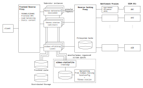

.. _NGINX: http://nginx.org/ 
.. _PostgreSQL: https://www.postgresql.org/
.. _eidaws.stationlite: https://github.com/damb/eidaws/tree/master/eidaws.stationlite 
.. _eidaws.endpoint_proxy: https://github.com/damb/eidaws/tree/master/eidaws.endpoint_proxy

=========================
EIDA Federator webservice 
=========================

Asynchronous implementation of a federating gateway webservice as part of EIDA
NG. Federation is performed for

- *fdsnws-station*
- *fdsnws-dataselect*
- *eidaws-wfcatalog*

webservices across all EIDA datacenters (DCs). This means a client can request
data from an ``eidaws-federator`` resource without having to know where the data
is actually hosted. In order to discover the information location the
``eidaws-stationlite`` webservice is used.

The implementation is based on Python's `aiohttp
<https://docs.aiohttp.org/en/stable/>`_ framework.

Features
========

- Requests are resolved to stream level
- Streamed responses
- Budget for endpoint requests i.e. endpoints are temporarily excluded from
  federation in case of erroneous behaviour
- Optional frontend cache powered by `Redis <https://redis.io/>`_
- HTTP connection pooling to increase both performance and to limit the number
  of concurrent endpoint requests configurable on federated resource granularity
- Support for both HTTP **POST** and **GET** endpoint request method
- Full support for virtual networks
- ``fdsnws-station`` requests run entirely in-memory
- ``fdsnws-dataselect`` and ``eidaws-wfcatalog`` request are buffered in-memory
  for small chunks of data; larger chunks of data are dynamically moved to disk
- ``fdsnws-dataselect`` and ``eidaws-wfcatalog``  response data is returned
  merged and fully aligned when splitting large requests
- Independent configuration of federated resources

Installation
============

Container
---------

A basic knowledge about container engines (e.g. `Podman <https://podman.io/>`_,
`Docker <https://docs.docker.com/engine/>`_) and how application containers work
is required. For more information about operating system support (which
includes Linux, macOS and specific versions of Windows) and on how to install a
container engine please refer to the official websites, e.g. `Podman website
<https://podman.io/getting-started/installation>`_, `Docker website
<https://www.docker.com/products/docker>`_.

The deployment described includes containerized versions of
``eidaws.federator``, eidaws.stationlite_ and eidaws.endpoint_proxy_.

**Features provided**:

* Based on `baseimage <https://hub.docker.com/r/phusion/baseimage/>`_
* NGINX_ + configurable number of standalone backend
  applications
* Backend caching powered by a NGINX_ HTTP reverse caching proxy
  (currently for ``fdsnws-station`` metadata, only)
* Bandwith limitation while fetching data from endpoints (implemented by means
  of eidaws.endpoint_proxy_)
* eidaws.stationlite_ deployed with `Apache2 <https://httpd.apache.org/>`_ +
  `mod_wsgi <https://modwsgi.readthedocs.io/en/develop/>`_; harvesting via
  ``cron`` powered by PostgreSQL_
* Python3.6/3.7
* Logging (syslog)

**Introduction**:

To build a container image with the appropriate configuration it is recommended
to build your image from a Dockerfile. Thus, first of all clone the repository. 

.. code::

  $ git clone https://github.com/damb/eidaws.git && cd eidaws

**Configuration**:

1. The ``eidaws.federator/container/federator/Dockerfile`` allows the number of
   backend applications to be configured during build time. The build args
   ``INSTANCES_DATASELECT_MINISEED``, ``INSTANCES_STATION_TEXT``,
   ``INSTANCES_STATION_XML`` and ``INSTANCES_WFCATALOG_JSON`` are provided in
   order to configure the number of federating backend services.

2. Before building and running the ``eidaws-stationlite`` container adjust the
   variables defined within ``eidaws.federator/container/env`` configuration
   file according to your needs.  Make sure to pick a proper username and
   password for the internally used PostgreSQL_ database and write these down
   for later.

**Building**:

Once your environment is configured you are ready to build the container
images, e.g.

.. code::

  $ docker build [--build-arg=INSTANCE_XXX=20] -t eidaws-federator:1.0 \
    -f eidaws.federator/container/federator/Dockerfile .
  $ docker build -t eidaws-endpoint-proxy:1.0 \
    -f eidaws.federator/container/proxy/Dockerfile .
  $ docker build -t eidaws-stationlite:1.0 \
    -f eidaws.federator/container/stationlite/Dockerfile .

**Compose Configuration**:

In case you want to manage your own volumes now is the time. The configuration
provided relies on named container volumes.

**Deployment**:

The containers should be run using the provided ``docker-compose.yml``
configuration file.

.. code::

  $ docker-compose -f eidaws.federator/container/docker-compose.yml up -d

If you're deploying the services for the very first time you are required to
create the database schema

.. code::

  $ docker exec eidaws-stationlite \
    /var/www/eidaws-stationlite/venv/bin/flask db-init

and perform an inital harvesting run

.. code::

  $ docker exec eidaws-stationlite \
    /var/www/eidaws-stationlite/venv/bin/eida-stationlite-harvest \
     --config /etc/eidaws-stationlite/harvest_config.yml

When the containers are running the service is available under
``http://localhost:8080`` (the internally used ``eidaws-stationlite`` routing
service is available under ``http://localhost:8089``).

**Architecture**:

The *eidaws-federator* provides a single, unified gateway to the waveform
archives and the station and quality control information from the entire EIDA
data holdings, i.e. from all the datacenters (DCs) in EIDA. It's *frontend
reverse proxy* implements standard FDSNWS and EIDAWS APIs.

If a client request reaches the frontend reverse proxy, the request is
dispatched and redirected to the corresponding federating instance. The
federating service then follows the procedure:

1. Check if the request was already received before and perform a frontend
   cache lookup (currently fdsnws-station metadata, only). If there is a cache
   hit the response is immediately returned to the client.
2. In case of a frontend cache miss requested stream epochs are fully resolved
   by means of *eidaws-stationlite* routing service. Thus, from now on, data is
   requested based on a granular (devide-and-conquer) request strategy from the
   *reverse caching proxy*.
3. Again, the reverse caching proxy has an internal cache (backend cache)
   (currently fdsnws-station metadata, only). Only in case the reverse caching
   proxy has a cache miss the (still granular) request is redirected to so
   called *bottleneck proxies*. Bottleneck proxies implement access limitation
   in order to prevent EIDA DCs from being overloaded.
4. Depending on the federated resource (``service-dataformat``) the federating
   instance firstly merges the granularly requested data before streaming the
   content back to the client.
5. Note that meanwhile the health status of EIDA DCs is monitored. If a DC
   cannot serve data it is temporarily excluded from data federation.

Static content is served by the frontend reverse proxy, directly.

*eidaws-stationlite*'s harvesting facility periodically harvests routing
information from *eidaws-routing* ``localconfig`` configuration files and to
some extent from *fdsnws-station*. Hence, storing the routing information adds
another, third, caching layer to the overall architecture.

Standalone
----------

**Dependencies**:

Make sure the following software is installed:

- `libxml2 <http://xmlsoft.org/>`_
- `libxslt <http://xmlsoft.org/XSLT/>`_

Regarding the version to be used visit http://lxml.de/installation.html#requirements.

To install the required development packages of these dependencies on Linux
systems, use your distribution specific installation tool, e.g. apt-get on
Debian/Ubuntu:

.. code::

  $ sudo apt-get install libxml2-dev libxslt-dev python3-dev

**Download**:

Clone the repository:

.. code::

  $ git clone https://github.com/damb/eidaws.git && cd eidaws

**Installation**:

In order to install ``eidaws.federator`` services, invoke

.. code::

  $ pip install eidaws.utils
  $ pip install eidaws.federator

Note, that encapsulating the installation by means of a `virtual environment
<https://docs.python.org/3/tutorial/venv.html>`_ is strongly recommended.

**Running**:

Federated resources are implemented as standalone applications with respect to
the resources' pathes. Thus, implementations of the following services are
provided:

- ``eidaws-wfcatalog-json`` (``/eidaws/wfcatalog/json/1``)
- ``fdsnws-dataselect-miniseed`` (``/eidaws/dataselect/miniseed/1``)
- ``fdsnws-station-xml`` (``/eidaws/station/xml/1``)
- ``fdsnws-station-text``  (``/eidaws/station/text/1``)

.. note::

  In favor of a simplified versioning scheme, both resource pathes and allowed
  values for the ``format`` query filter parameter are application specific
  and **not** compliant with `FDSN webservice <https://www.fdsn.org/webservices/>`_
  standards. In order to provide a fully `FDSN webservice
  <https://www.fdsn.org/webservices/>`_ conform API consider the deployment
  behind a *reverse proxy*.

After installing the ``eidaws.federator`` distribution with

.. code::

  $ pip install eidaws.utils eidaws.federator

the corresponding standalone applications are available:

- ``eida-federator-wfcatalog-json``
- ``eida-federator-dataselect-miniseed``
- ``eida-federator-station-xml``
- ``eida-federator-station-text``

Running one of those application is as simple as e.g.

.. code::

  $ eida-federator-wfcatalog-json

Now the service should be up and running at ``localhost:8080``. Check out the
`Configuration`_ section if you'd like to run the service on a different
``hostname:port`` destination.

Additional information and help is provided when invoking the application with
the ``-h|--help`` flag. E.g.

.. code::

  $ eida-federator-wfcatalog-json -h

Note, that for production it has several advantages running the services behind
a *reverse proxy server* such as e.g. NGINX_. In particular, if providing a
fully compliant `FDSN webservice <https://www.fdsn.org/webservices/>`_ API is
desired.

Configuration
=============

Federated resource service applications can be configured by means of a `YAML
<https://en.wikipedia.org/wiki/YAML>`_ configuration file. An exemplary fully
documented configuration file is provided under
``eidaws.federator/config/eidaws_config.yml.example``. In order to change the default
configuration make a copy of the example configuration with e.g.

.. code::

  $ cp -v eidaws.federator/config/eidaws_config.yml.example \
    eidaws.federator/config/eidaws_config.yml

and adopt the file according to your needs. Then invoke the corresponding
service application with the ``-c|--config`` flag e.g.

.. code::

  $ eida-federator-wfcatalog-json -c eidaws.federator/config/eidaws_config.yml

Logging
=======

The *eidaws.federator* distribution uses standard `logging
<https://docs.python.org/3/library/logging.html#module-logging>`_ for tracking
the application activity.

Depending on the federated resource service the following loggers enumerated by
name are provided:

- ``eidaws.federator.eidaws.wfcatalog.json``
- ``eidaws.federator.fdsnws.dataselect.miniseed``
- ``eidaws.federator.fdsnws.station.text``
- ``eidaws.federator.fdsnws.station.xml``

When configuring logging by means of a logging configuration file (see also the
`Configuration`_ section), you may subscribe to one of these loggers for
getting log messages.

Testing
=======

Make sure that an `Redis <https://redis.io/>`_ server instance is up and
running at ``redis://localhost:6379``.

Required test dependencies can be installed with  

.. code::

  $ pip install -r eidaws.federator/requirements/test.txt

In order to run the tests, invoke

.. code::

  $ pytest eidaws.utils eidaws.federator

Limitations
===========

- AAI of the *fdsnws-dataselect* service is not implemented yet
- A ``fdsnws-station-xml&level=channel|response`` metadata request including only a
  single datacenter might be quite imperformant compared to a direct request to
  the corresponding datacenter.
- In certain cases, HTTP response codes might be misleading due to limitations
  of the `FDSN webservice <https://www.fdsn.org/webservices/>`_ specification
  not fully prepared to operate in a distributed environment.
